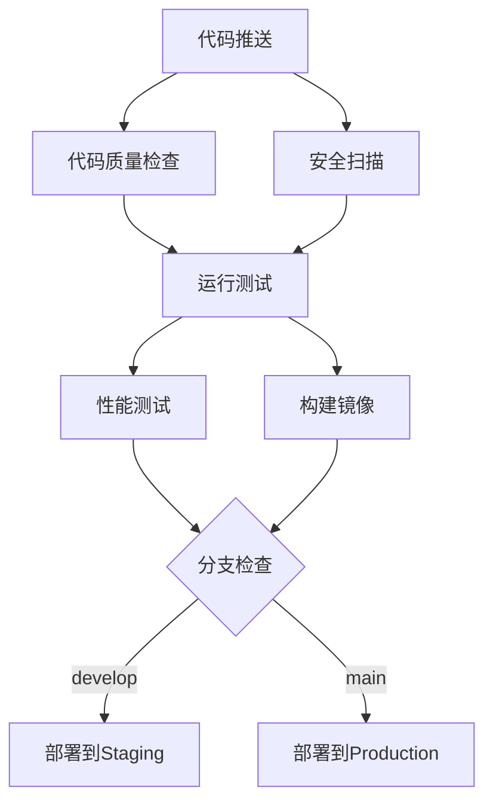

# 🚀 HDCP CI/CD 流水线指南

本文档说明HDCP模板的持续集成和持续部署流水线。

---

## 📋 CI/CD 概览

HDCP模板使用GitHub Actions实现完整的CI/CD流水线：

- ✅ 代码质量检查 (Linting)
- ✅ 安全扫描
- ✅ 自动化测试
- ✅ 性能测试
- ✅ Docker镜像构建
- ✅ 自动部署

---

## 🏗️ 工作流架构

### 主流水线 (`ci-cd.yml`)



### 流水线阶段

#### 1. 代码质量检查 (Lint)
- **Black** - 代码格式化检查
- **isort** - 导入排序检查
- **flake8** - 代码规范检查
- **pylint** - 代码质量分析
- **MyPy** - 类型检查
- **Bandit** - 安全代码检查
- **Safety** - 依赖漏洞检查

#### 2. 安全扫描 (Security)
- **Safety** - Python包漏洞扫描
- **Bandit** - 安全代码模式扫描
- **Semgrep** - 静态安全分析

#### 3. 测试套件 (Test)
- **单元测试** - 模型和业务逻辑测试
- **集成测试** - API集成测试
- **API测试** - 端到端API测试
- **覆盖率** - 代码覆盖率报告

#### 4. 性能测试 (Performance)
- **查询优化测试**
- **缓存性能测试**
- **基准测试**

#### 5. 构建打包 (Build)
- **Docker镜像构建**
- **推送至GitHub Container Registry**

#### 6. 部署 (Deploy)
- **Staging部署** - develop分支
- **Production部署** - main分支

---

## 📁 工作流文件

| 文件 | 描述 | 触发条件 |
|------|------|----------|
| `ci-cd.yml` | 主CI/CD流水线 | Push/PR |
| `dependency-update.yml` | 依赖更新 | 每周/手动 |
| `security-scan.yml` | 安全扫描 | 每日/Push/PR |

---

## 🔧 配置

### 环境变量

在GitHub仓库设置中添加以下secrets：

```bash
# 部署相关
KUBECONFIG         # Kubernetes配置
STAGING_URL        # Staging环境URL
PRODUCTION_URL     # Production环境URL

# 通知相关
SLACK_WEBHOOK      # Slack通知
EMAIL_SMTP         # 邮件通知配置

# 外部服务
CODECOV_TOKEN      # Codecov集成
```

### 仓库设置

1. **启用分支保护**
   - 要求状态检查通过
   - 要求分支保持最新
   - 包括管理员

2. **启用GitHub Pages**
   - 部署从gh-pages分支
   - 使用Actions工作流

3. **配置GitHub Container Registry**
   - 设置访问权限
   - 配置包生命周期

---

## 🚦 工作流详情

### 代码质量检查

```yaml
lint:
  name: Code Quality
  steps:
    - name: Run Black
      run: black --check apps/api/

    - name: Run flake8
      run: flake8 apps/api/

    - name: Run pylint
      run: pylint apps/api/

    - name: Run Bandit
      run: bandit -r apps/api/app/
```

**阈值要求：**
- 代码覆盖率 > 80%
- 无严重安全漏洞
- 代码格式化检查通过

### 安全扫描

```yaml
security:
  name: Security Scan
  steps:
    - name: Run Safety
      run: safety check

    - name: Run Semgrep
      run: semgrep --config=auto apps/api/
```

**检查内容：**
- 依赖漏洞
- 代码安全模式
- 敏感信息泄露
- 容器镜像扫描

### 测试流水线

```yaml
test:
  name: Test Suite
  strategy:
    matrix:
      test-type: [unit, integration, api]
  services:
    postgres: postgres:15
    redis: redis:7
  steps:
    - name: Run tests
      run: pytest tests/ -v -m ${{ matrix.test-type }}
```

**测试类型：**

1. **单元测试**
   - 模型测试
   - 业务逻辑测试
   - 快速执行

2. **集成测试**
   - 数据库集成
   - 缓存集成
   - 中等执行时间

3. **API测试**
   - 端到端测试
   - 完整API流程
   - 执行时间较长

### 构建阶段

```yaml
build:
  name: Build
  steps:
    - name: Build API image
      uses: docker/build-push-action@v5
      with:
        context: .
        file: ./apps/api/Dockerfile
        push: true
        tags: ghcr.io/${{ github.repository_owner }}/hdcp-api:latest
```

**构建要求：**
- 多阶段Docker构建
- 镜像优化
- 安全基础镜像
- 非root用户

### 部署阶段

```yaml
deploy-production:
  name: Deploy to Production
  if: github.ref == 'refs/heads/main'
  steps:
    - name: Deploy
      run: kubectl apply -f k8s/production/
```

**部署流程：**
1. 推送触发部署
2. 等待健康检查
3. 流量切换
4. 验证部署

---

## 📊 监控和报告

### Codecov集成

```yaml
- name: Upload coverage to Codecov
  uses: codecov/codecov-action@v3
  with:
    file: apps/api/coverage.xml
    flags: unit
```

**报告内容：**
- 代码覆盖率趋势
- 分支覆盖率
- PR覆盖率

### 质量门禁

| 检查项 | 阈值 | 失败时 |
|--------|------|--------|
| 代码覆盖率 | 80% | 阻止合并 |
| 安全漏洞 | 0高危 | 阻止合并 |
| 测试失败 | 0 | 阻止合并 |
| 代码风格 | 100%通过 | 阻止合并 |

---

## 🔄 自动化依赖更新

### 依赖更新工作流

每周一自动运行：
1. 检查依赖更新
2. 运行安全扫描
3. 测试更新
4. 创建PR

```yaml
update-dependencies:
  schedule:
    - cron: '0 0 * * 1'  # 每周一
  steps:
    - name: Update dependencies
      run: pip-compile --upgrade requirements.in

    - name: Create PR
      uses: peter-evans/create-pull-request@v5
```

---

## 🛡️ 安全最佳实践

### 1. 最小权限原则

```yaml
permissions:
  contents: read
  security-events: write
  actions: read
```

### 2. Secrets管理

- 使用GitHub Secrets存储敏感信息
- 定期轮换secrets
- 不在代码中硬编码密钥

### 3. 分支保护

- main分支需要PR
- 要求所有检查通过
- 包括管理员

### 4. 容器安全

- 使用非root用户
- 最小化镜像层
- 扫描镜像漏洞
- 使用私有仓库

---

## 🎯 性能优化

### 并行化

```yaml
strategy:
  matrix:
    test-type: [unit, integration, api]
```

并行运行测试加速流水线。

### 缓存

```yaml
- name: Cache pip dependencies
  uses: actions/cache@v3
  with:
    path: ~/.cache/pip
    key: ${{ runner.os }}-pip-${{ hashFiles('**/requirements.txt') }}
```

缓存依赖减少安装时间。

### 资源使用

- 适度选择runner
- 及时清理资源
- 使用缓存优化

---

## 📝 通知

### Slack通知

```yaml
- name: Notify Slack
  if: always()
  uses: 8398a7/action-slack@v3
  with:
    status: ${{ job.status }}
    channel: '#ci-cd'
```

### 邮件通知

```yaml
- name: Send email
  if: failure()
  uses: dawidd6/action-send-mail@v3
  with:
    server_address: smtp.gmail.com
    subject: CI/CD Pipeline Failed
```

---

## 🔍 故障排除

### 常见问题

#### 1. 测试失败

```bash
# 本地运行测试
pytest tests/ -v

# 查看覆盖率
pytest --cov=app --cov-report=html
```

#### 2. 安全扫描失败

```bash
# 本地运行安全扫描
safety check
bandit -r apps/api/app/
```

#### 3. 构建失败

```bash
# 本地构建Docker镜像
docker build -t hdcp-api ./apps/api/
```

### 日志查看

```bash
# 查看工作流日志
gh run list
gh run view <run-id> --log

# 下载日志
gh run view <run-id> --log > workflow.log
```

---

## 📚 参考资料

- [GitHub Actions文档](https://docs.github.com/en/actions)
- [Docker Build Action](https://github.com/docker/build-push-action)
- [Codecov Action](https://github.com/codecov/codecov-action)
- [Kubernetes部署](https://kubernetes.io/docs/concepts/workloads/controllers/deployment/)

---

## 🚀 快速开始

### 1. 启用Actions

```bash
# 在仓库根目录创建.github/workflows/
mkdir -p .github/workflows
```

### 2. 配置Secrets

在GitHub仓库设置中添加所需的secrets。

### 3. 推送代码

```bash
git add .github/workflows/
git commit -m "feat: add CI/CD pipeline"
git push origin main
```

### 4. 监控流水线

访问GitHub Actions页面监控流水线运行。

---

**记住**: 好的CI/CD流水线是高效开发的基础！

